<p align="center">
  
</p>


# mseek - process scanner / memory search tool for strings and regular expressions

<div style="font-weight:bold;background-color:red;color:white;padding:2%;"><h2> 😈 ⚠️ 😈 ⚠️ 😈 This is an Extended Scope Version on Branch ext-dev & extended_scope_main 😈 ⚠️ 😈 ⚠️ 😈</h2></div>
<div style="font-weight:bold;background-color:rgb(205,92,92);color:white;padding:2%;">

➱ ➬ ➫ ➯ ⇨ The added features are super useful when reverse-engineering software, but I feel are outside the scope of the original project. 🠼 🡀 🠸 🢘 🡸

➱ ➬ ➫ ➯ ⇨ Hence for now, instead of creating a new program, I will extend the features and treat this as a separate entity. 🠼 🡀 🠸 🢘 🡸

</div>


A fast and powerful tool to search for strings and patterns in the memory space of running processes on a 64-bit/32bits Windows system.

In the example below, you see it was used to crack the F-Secure Freedome VPN client


---

### 🛠 How to Build - Information

```
./Build.bat 
```

Or

Visual Studio 2019


### Version generation

Avoid version files generation to mess your commits:

```bash
git update-index --assume-unchanged src/version.cpp
git update-index --assume-unchanged build.nfo
```


## 📦 Usage

```
xmseek.exe <-s string> <-p PID | -n PROCESSNAME | -i FILE> [options]
```

### 🔧 Required Arguments:
- `-s <string>` : String to search for
- `-p <PID>` : Target a specific process by its ID  
  **or**  
- `-n <PROCESSNAME>` : Target a process by its name  
  **or**  
- `-i <file>` : Read multiple search strings from a file (one per line)

---

### 🧩 Options

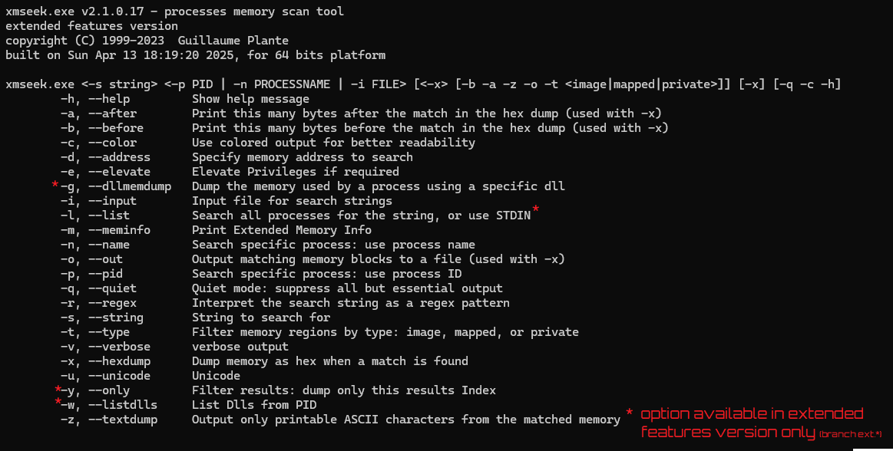

---

## 💡 Examples

1. Search for a string in a specific process using process name <sup>[1](#ref1)</sup>

```sh
xmseek.exe -n fsvpnservice_64.exe -s "<key>" 
```
2. Search for a string in a specific process using process id <sup>[2](#ref1)</sup>

```sh
xmseek.exe -pid 2476 -s "<key>" 
```

3. Search for a string, print 200 bytes **after** found instance <sup>[3](#ref2)</sup>
```Get the address: 0x0000027B10F5E70E```
```sh
xmseek.exe -n fsvpnservice_64.exe -s "<key>" -x -a 200
```
4. Search for a string, print 100 bytes **before** found instance <sup>[4](#ref3)</sup>
```Get the address: 0x0000027B10F5EDE4```
```sh
xmseek.exe -n fsvpnservice_64.exe -s "<key>" -x -b 100
```
5. Get Delta Memory using addresses <sup>[5](#ref4)</sup>

Diff the address: ```0x0000027B10F5EDE4 - 0x0000027B10F5E70E = 1750```

6. Search for a string, print 1750 bytes **after** found instance, output in file, **printable charcaters only** <sup>[6](#ref5)</sup>

--------------------------------

## 💡 REGEX patterns

The example below will look for all GUIDS with this REGEX pattern<sup>[7](#ref6)</sup> : ```"\{[0-9A-Fa-f]{8}-[0-9A-Fa-f]{4}-[0-9A-Fa-f]{4}-[0-9A-Fa-f]{4}-[0-9A-Fa-f]{12}\}"```


1. Search for a **REGEX PATTERN**, in **PRIVATE** memory, output in file, **printable charcaters only** <sup>[7](#ref6)</sup>


```
> xmseek.exe -n fsvpnservice_64.exe -s "\{[0-9A-Fa-f]{8}-[0-9A-Fa-f]{4}-[0-9A-Fa-f]{4}-[0-9A-Fa-f]{4}-[0-9A-Fa-f]{12}\}" -t private -r -o "d:\mem.txt" -x -z
```
--------------------------------

## 💡 Using STDIN for Processes


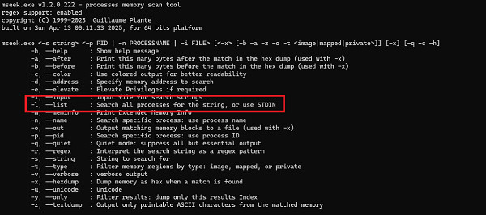

Using the argument **-l or --list** , you can either **list and search ALL processes** or use **stdin** to input processes.

As an example, I wrote the scripts: *[Find-FSecure.ps1](scripts\Find-FSecure.ps1)* and *[Find-ProcessIn.ps1](scripts\Find-ProcessIn.ps1)* that will list the PIDs
of processes of executables located in certain paths.

```powershell
> Find-ProcessIn -Path "C:\Program Files\F-Secure\TOTAL\x64" -IncludeChildren

   Id Name                   CommandLine
   -- ----                   -----------
 1700 openvpn.exe            "C:\Program Files\F-Secure\TOTAL\x64\UnifiedSDK.Service-x64_2\Executable\OpenVpn\x64\openvpn.exe" --config "C:\ProgramData\F-Secure\NS\default\FSVpnSDK\system\openvpn\ovpn.cfg"
 3832 wintun_c.exe           "C:\Program Files\F-Secure\TOTAL\x64\UnifiedSDK.Service-x64_2\Executable\OpenVpn\x64\wintun_c.exe"
 5344 fshoster64.exe         "C:\Program Files\F-Secure\TOTAL\x64\fshoster64.exe" --service --namespace default --id 0
 7396 fshoster64.exe         "C:\Program Files\F-Secure\TOTAL\x64\fshoster64.exe" --app --namespace default --id 1
10128 fshoster64.exe         "C:\Program Files\F-Secure\TOTAL\x64\fshoster64.exe" --service --namespace default --id 2
11772 UnifiedSDK.Service.exe "C:\Program Files\F-Secure\TOTAL\x64\UnifiedSDK.Service-x64_2\UnifiedSDK.Service.exe" -run "C:\ProgramData\F-Secure\NS\default\FSVpnSDK\UnifiedSDK.config"
```

So get the PIDs:

```powershell
> Find-ProcessIn -Path "C:\Program Files\F-Secure\TOTAL\x64" -IncludeChildren | Select -ExpandProperty Id
1700
3832
5344
7396
10128
11772
```


The example below will input all the PIDs found in the script and pass them the mseek for search <sup>[8](#ref7)</sup>

```bash
.\scripts\Find-FSecure.ps1 | Select -ExpandProperty Id |  > xmseek.exe -l -s "<key>"

xmseek.exe v1.2.0.222 - processes memory scan tool
regex support: enabled
copyright (C) 1999-2023  Guillaume Plante
built on Sun Apr 13 00:11:33 2025, for 64 bits platform

[i] execution with administrator privileges!
[i] checking stdin...
[i] searching in 12 processes from stdin:
1700, 3832, 5344, 7396, 10128, 11772, 1700, 3832, 5344, 7396, 10128, 11772,
[done] 2 hits found in pid 11772 (C:\Program Files\F-Secure\TOTAL\x64\UnifiedSDK.Service-x64_2\UnifiedSDK.Service.exe)
[done] 2 hits found in pid 11772 (C:\Program Files\F-Secure\TOTAL\x64\UnifiedSDK.Service-x64_2\UnifiedSDK.Service.exe)
PID 11772 had 4 hits
  - Hit at address: 0x0000020a5fd1e169
  - Hit at address: 0x0000020a604c2169
  - Hit at address: 0x0000020a5fd1e169
  - Hit at address: 0x0000020a604c2169
```

--------------------------------


## 💡 Search ALL processes

Below, we use the argument **-l or --list** WITHOUT piping any data in STDIN, it will search in ALL processes.

```bash
 > xmseek.exe -l -s "<key>"
```

--------------------------------


## 💡 List Processes Loaded Dlls

The example below will use the ```--listdlls``` option to list the DLLs from a process <sup>[9](#ref8)</sup>

```powershell
xmseek.exe --listdlls 18648 --nobanner                   <# listdlls, '--nobanner' to remove program info header #> `
                    | Select -Skip 1                     <# 'Select -Skip 1' to skip log line #> `
                    | ConvertFrom-Csv                    <# we use the 'ConvertFrom-Csv' cmdlet to parse the output #> `
                    | Sort-Object -Property BaseAddress  <# we use the 'Sort-Object' cmdlet to sort every dll entries based on the address (load order)  #> `
                    | Where ModulePath -match 'F-Secure' <# filter out the DLLs not in the F-Secure directory #>
```


--------------------------------


## 💡 List Processes Loaded Dlls and the functions

The example below will use the ```--listdlls``` option to list the DLLs from a process <sup>[9](#ref8)</sup> AND Use the ```Get-DllExportsList``` script to list the functions from those DLLS <sup>[10](#ref9)</sup>

```powershell
xmseek.exe --listdlls 18648 --nobanner                   <# listdlls, '--nobanner' to remove program info header #> `
                    | Select -Skip 1                     <# 'Select -Skip 1' to skip log line #> `
                    | ConvertFrom-Csv                    <# we use the 'ConvertFrom-Csv' cmdlet to parse the output #> `
                    | Sort-Object -Property BaseAddress  <# we use the 'Sort-Object' cmdlet to sort every dll entries based on the address (load order)  #> `
                    | Where ModulePath -match 'F-Secure' <# filter out the DLLs not in the F-Secure directory #>
> $Dlls | Where ModuleName -match 'vpn' | Select -ExpandProperty ModulePath | % { $path = "$_"
             ForEach($func in (Get-DllExportsList -DllPath "$path")){
                $sig = '{0} {1}({2})' -f $func.ReturnValue, $func.Member, $func.Parameters
                $sig
  } 
 }
```                   


--------------------------------


### 32bit Version Build in Win32 Configuration

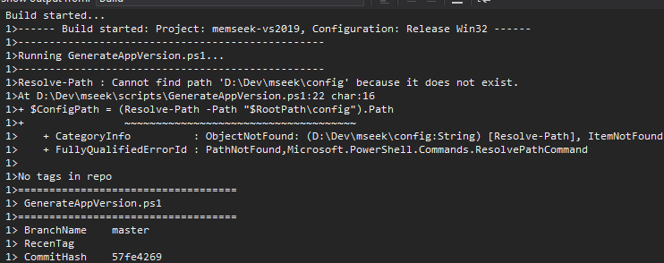

### NOTE 

IF NOT RUNNNIG AS ADMIN, Some Process Are Not Accessible! If you cannot read a process memory, open a shell as administrator!

#### Auto-Elevate Privilege

You can use ```-e``` to auto -elevate privileges (not fully supported, best you run directly in admin mode). If detected, auto elevate will sleep on exit, because a new window is opened and you want to read the results.


--------------------------------

## Wishlist and Planned Features

1. Add an option to output search results in JSON or CSV fornats so that they can be easily parsed in PowerShell
1. Add a Encryption Pattern  detction, brute-force decryption of memory segments.


--------------------------------


## 📝 License

This software is provided as-is for educational and forensic analysis purposes. Use responsibly.

--------------------------------

<p align="center">
  
</p>


> Created by [Guillaume Plante](guillaumeplante.qc@gmail.com)
<br>
<br>

[mseek](https://github.com/arsscriptum/mseek) has been helping developers and analysts dig into memory since 2022.


--------------------------------

<a id="ref1"></a> [1] 

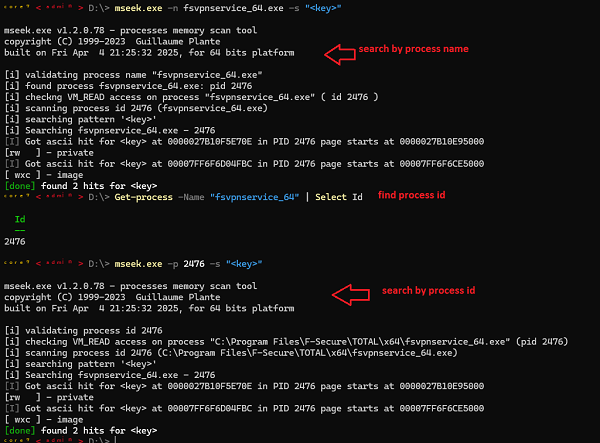

-------------------------------

<a id="ref2"></a>[2] 


-------------------------------

<a id="ref2"></a>[3] 

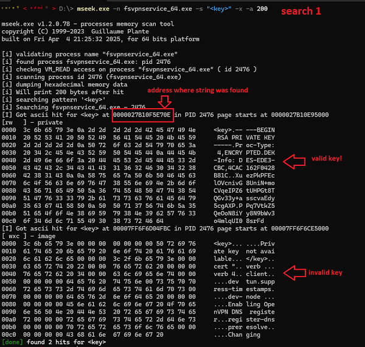

-------------------------------

<a id="ref3"></a>[4] 

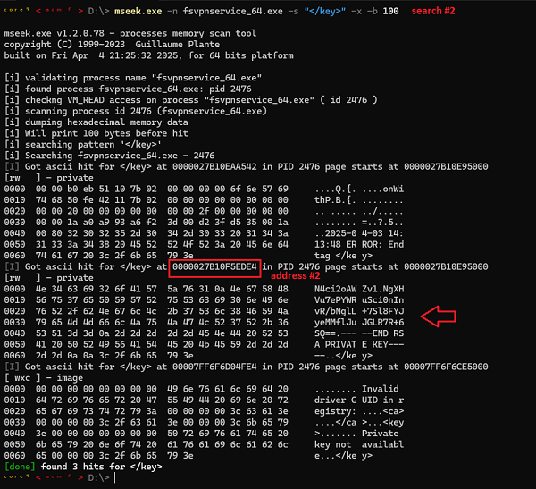

-------------------------------

<a id="ref4"></a>[5] 

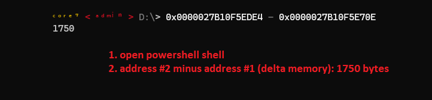

-------------------------------


<a id="ref5"></a>[6] 

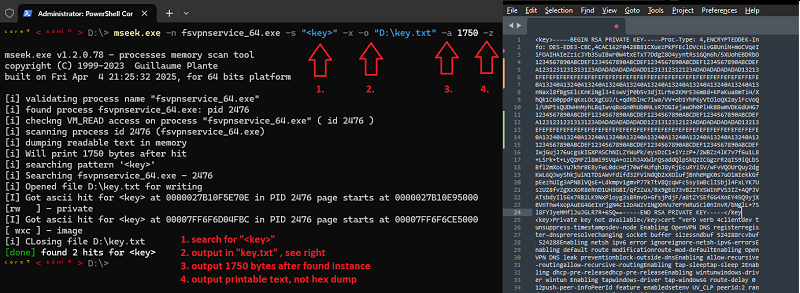


-------------------------------

<a id="ref6"></a>[7] 
<a href="img/regex.gif" target="_blank">
  
</a>

-------------------------------

<a id="ref7"></a>[8] 

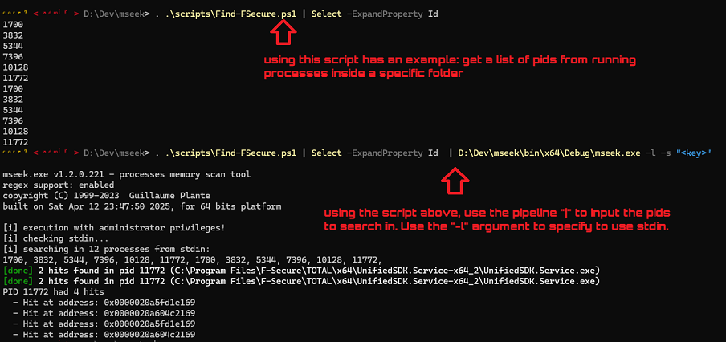


-------------------------------

<a id="ref8"></a>[9] 

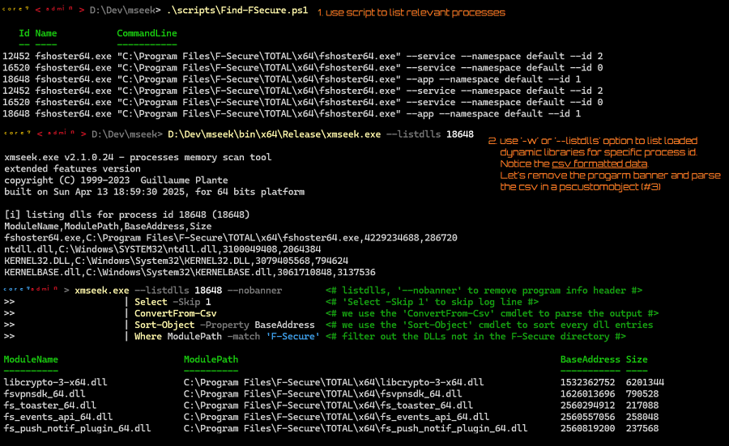

-------------------------------

<a id="ref9"></a>[10] 

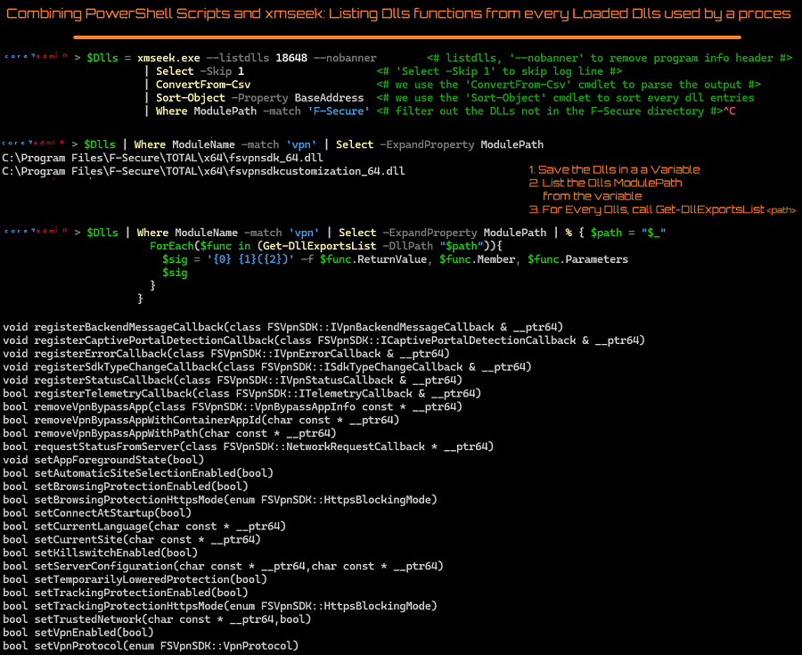
